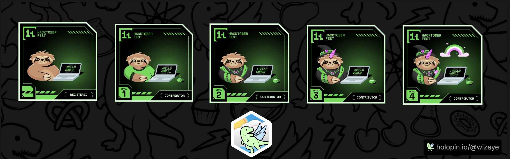

  

 

  
  
  

<h1 align="center">Hey There 🙋🏻</h1>

## 👨‍💻 About Me

Hello! I'm **Vijayendher Gatla**, a software engineer from Hyderabad, India, passionate about building scalable, robust, and innovative software solutions. My interests span across full-stack development, machine learning, artificial intelligence, and blockchain technology.

- **🔭 Currently:** Working on Deep Learning projects.
- **🌱 Learning:** Next.js and advanced web technologies.
- **👯 Looking to collaborate:** On Artificial Intelligence and open-source projects.
- **🤝 Seeking help:** With Web3 and blockchain technologies.

---

## 🛠️ Tech Stack

<table>
  <tr>
    <td valign="top" width="25%">
      <h3>Languages</h3>
      

        
        
        
        
        
        
      

    </td>
    <td valign="top" width="25%">
      <h3>Frameworks</h3>
      

        
        
        
        
        
        
      

    </td>
    <td valign="top" width="25%">
      <h3>Tools & Platforms</h3>
      

        
        
        
        
        
      

    </td>
    <td valign="top" width="25%">
      <h3>Databases & Libraries</h3>
      

        
        
        
        
        
      

    </td>
  </tr>
</table>

---

## 🌟 Open Source Contributions

---

## 📊 My Stats

  
  
  

---

  

